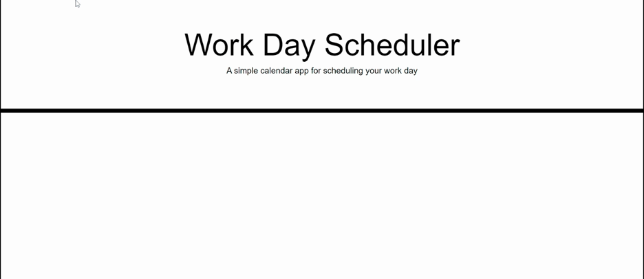
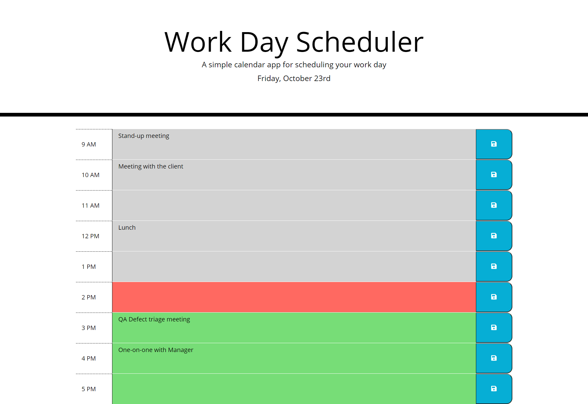

# workday-scheduler
A simple workday planner application color-coded to indicate the past, present and future times and can save tasks/events for the day. It is built using Javascriot and JQuery.

## User Story

```
AS AN employee with a busy schedule
I WANT to add important events to a daily planner
SO THAT I can manage my time effectively

```

## Acceptance Criteria

```
GIVEN I am using a daily planner to create a schedule
WHEN I open the planner
THEN the current day is displayed at the top of the calendar
WHEN I scroll down
THEN I am presented with time blocks for standard business hours
WHEN I view the time blocks for that day
THEN each time block is color-coded to indicate whether it is in the past, present, or future
WHEN I click into a time block
THEN I can enter an event
WHEN I click the save button for that time block
THEN the text for that event is saved in local storage
WHEN I refresh the page
THEN the saved events persist

```

## Description

This is a simple calendar application that a user can use to schedule his work day events. The application allows a user to save events for each hour of the day. It uses the browser's local storage to store and retrieve the events. The time-blocks are color-coded to reflect past, present and future times. The code uses [Moment.js](https://momentjs.com/) library to work with date and time. 

- The application will run in the browser and has a clean, polished and responsive user interface.
- The application features dynamically updated HTML and CSS powered by Javascript code.

## My contribution

- Created HTML elements dynaically using jQuery.
- Read the moment.js documentation and implemented the moment.js formats and queries for time comparison as well as to display the current date.
- Identified and added the appropriate classes to the HTML elements so that the styling gets applied as expected.
- Refactored and reorganized the code for better presentation.
- Added comments/pseudo-code to help understand the logic.


## For Review

* Deployed Application URL: https://jesaldm.github.io/workday-scheduler/.
* Github Repository URL: https://github.com/JesalDM/workday-scheduler/
* Application functionality demo: 
* Screenshot : 
